# Catálogo de Proveedores
- Aplicación de Escritorio para Windows para Agroveterinaria de Sonora S.A. de C.V

## Propósitos de Aplicación

General: Organizar y mejorar la calidad de la información de Proveedores de la Agroveterinaria de Sonora para tomar mejores decisiones
Compras: Gestionar contactos, garantías, compras y fletes. Obtener información de acuerdos realizados con el proveedor
Tesorería: Obtener información de contactos, pago y acuerdos

## Instalación

Para poder instalar es necesario cargar el proyecto Setup dentro del proyecto de la aplicación en un editor de texto/código como Visual Studio 2019

## Uso de Aplicación 

Snapshots de Aplicación:
### Inicio de Sesión
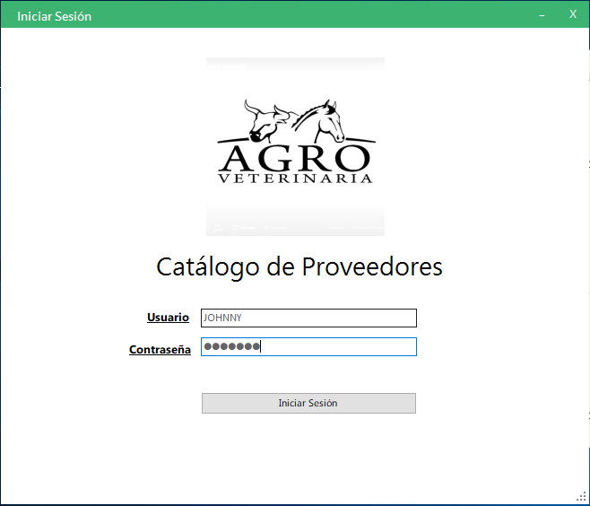

### Inicio de Sesión fallida
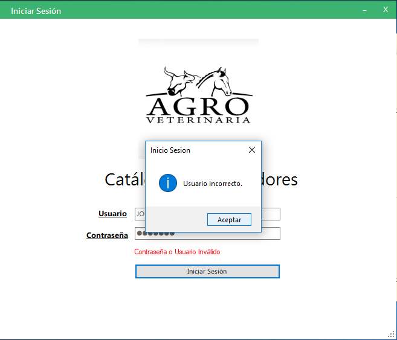

### Página Principal
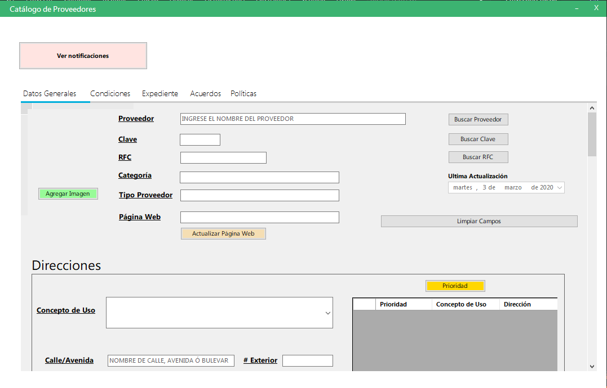

### Centro de Notificaciones
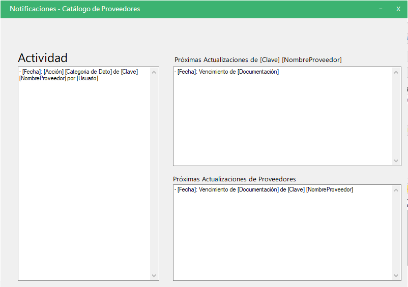

### Datos Primarios de Proveedor
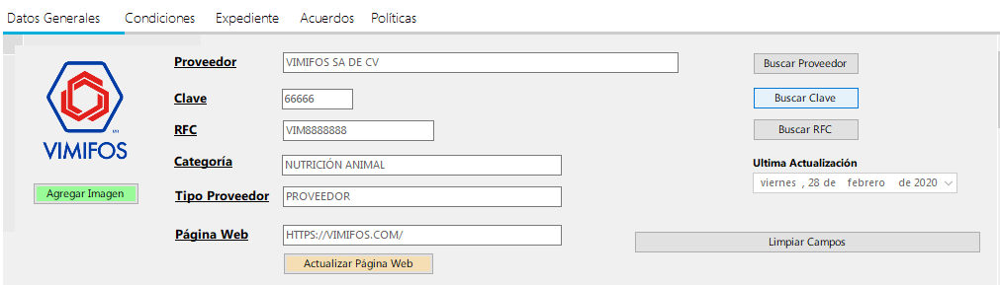

### Contactos de Proveedor (mismo formato que Direcciones)
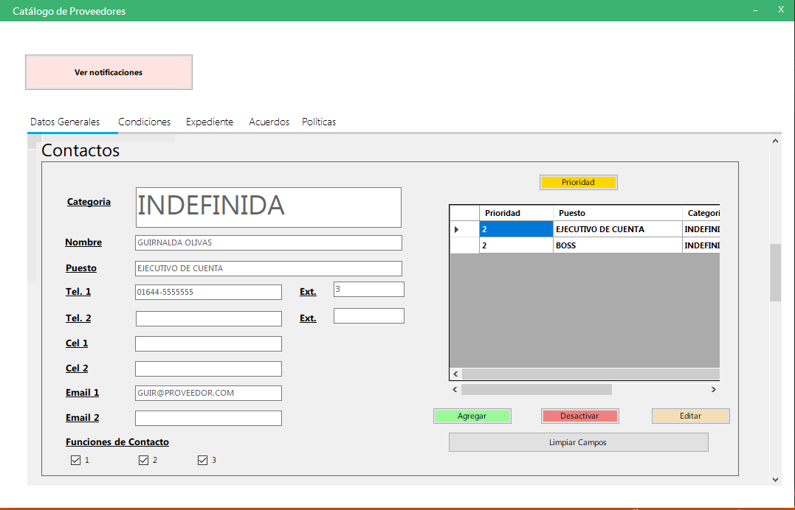

### Datos Bancarios de Proveedor; mismo formato para Nacionales y Extranjeros
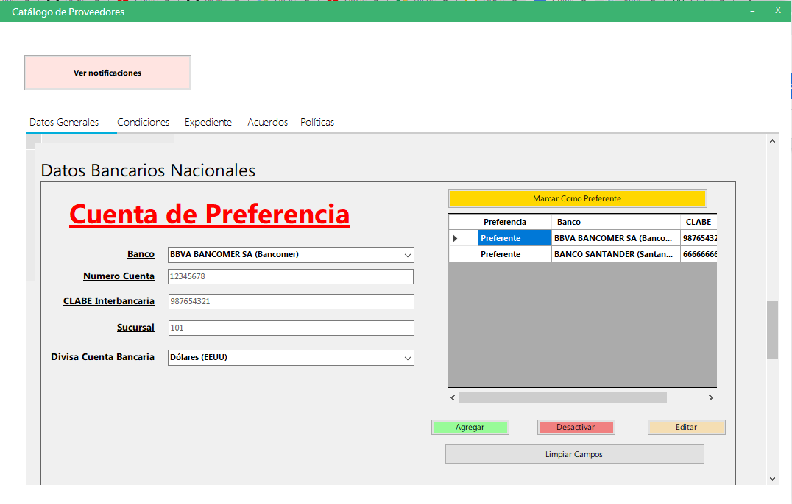

### tab de Condiciones de Proveedor
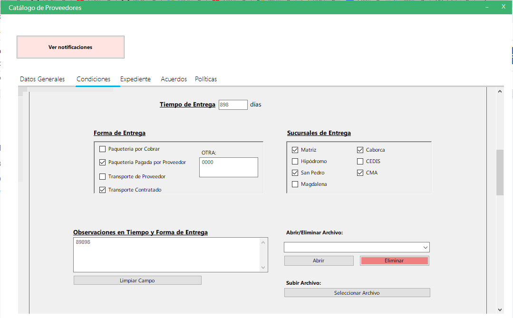

### tab de Acuerdos de Proveedor
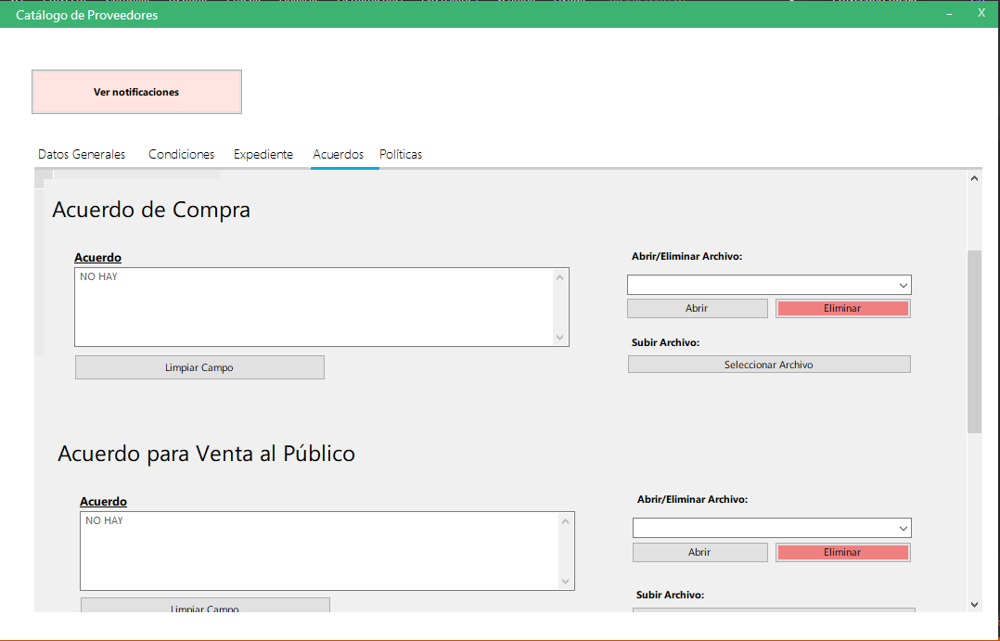

### tab de Expediente de Proveedor
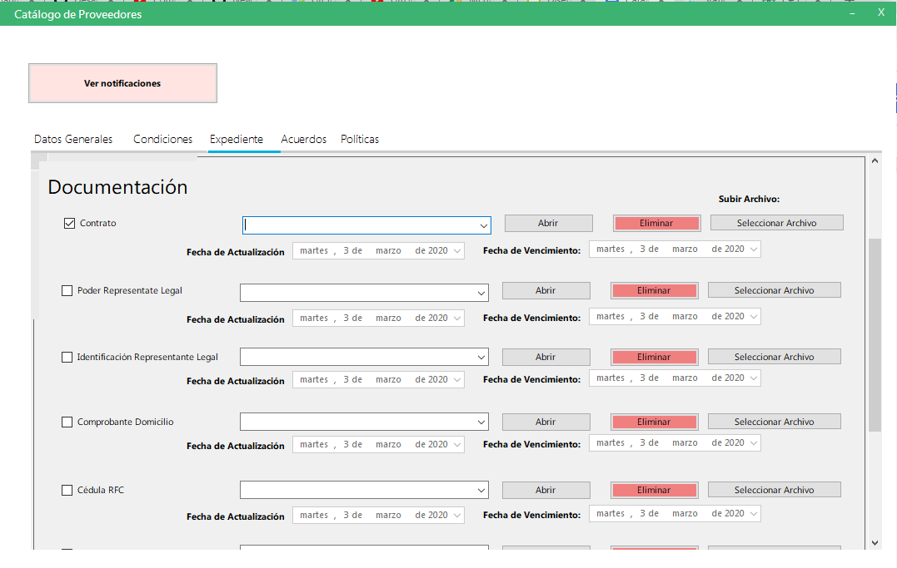

### tab de Políticas de Proveedor
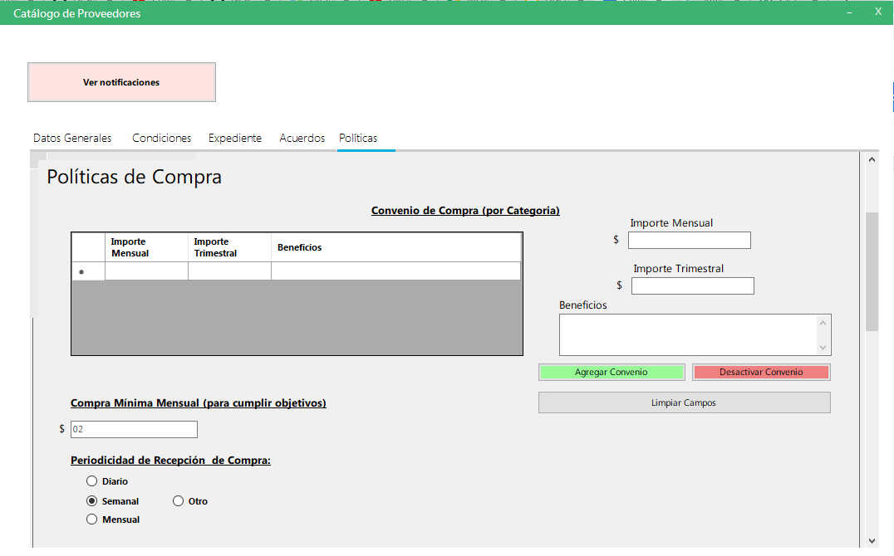
